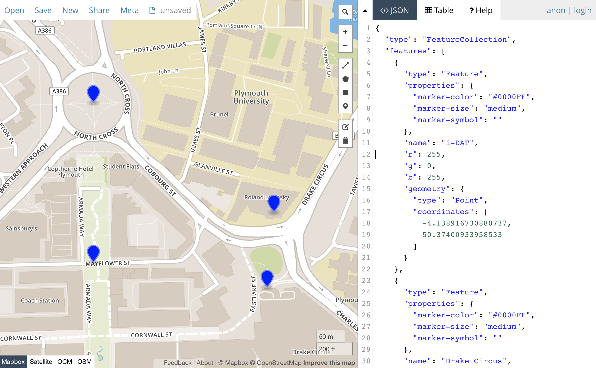
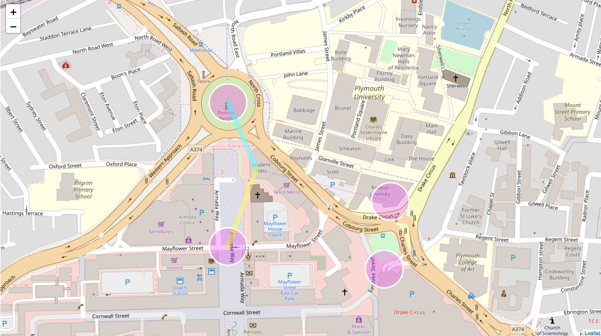

# Interactive Maps with Mappa, Leaflet, and GeoJSON

## Introduction
This example uses the libraries Mappa.js and Leaflet.js together with a GeoJSON data file to construct an interactive map that is visualized with the use of P5.js.

---

## GeoJSON

GeoJSON is a format for encoding a variety of geographic data structures, as the following example, that contains various values important for a map system, such as name of location and coordinates:

```JavaScript
{
  "type": "Feature",
  "geometry": {
    "type": "Point",
    "coordinates": [125.6, 10.1]
  },
  "properties": {
    "name": "Dinagat Islands"
  }
}
```

To easily develop a GeoJSON file, the website [geojson.io](geojson.io) offers options for creating, viewing, and sharing maps using the GeoJSON data format, amongst others (such as GPX, CSV, and so on). The picture below demonstrates how the selected map points are translated to GeoJSON format, which can be saved in a file and used in our project.

<p align="center">

</p>

---

## Mappa, Leaflet, P5

[Mappa](https://mappa.js.org) is a library to facilitate work between the canvas element and existing map libraries and APIs. It provides a set of tools for working with static maps, interactive tile maps and geo-data among other tools useful when building geolocation-based visual representations.

To access the properties of the library, make sure that you include it in your project (in this example it is in the **libraries** folder). Mappa provides access to a range of other location API systems. Here, we will be using [Leaflet.js](https://leafletjs.com/examples/geojson/)

The following example uses the Mappa and Leaflet map systems to visualize on an interactive map the data stored in the GeoJSON file we created. In addition, we are using the P5.js library to create additional interactions with this information.

```JavaScript
//Initialize variables
var myMap;
var canvas;
var mappa = new Mappa('Leaflet');
var geoJSON, geoJSONlength;

//Initialize arrays to store the GeoJSON values
var loc = [],
		lat = [],
		lon = [],
		r = [],
		g = [],
		b = [];

var sizeCircle = 80;

//Setting up properties for the Leaflet-Mappa
var options = {
	lat: 50.3745,
	lng: -4.141,
	zoom: 17.4,
	style: "http://{s}.tile.osm.org/{z}/{x}/{y}.png"
}

//Load the map
function preload(){
	geoJSON = loadJSON("map.geojson", getGJSON);
}

//Call-back function for getting the GeoJSON data
//After extraction, push the values on each separate array
function getGJSON(data){
	geoJSONlength = data.features.length;
	for (var i = 0; i < geoJSONlength; i++) {
		lat.push(data.features[i].geometry.coordinates[1]);
		lon.push(data.features[i].geometry.coordinates[0]);
		r.push(data.features[i].r);
		g.push(data.features[i].g);
		b.push(data.features[i].b);
	}
}

function setup(){
	canvas = createCanvas(1280,720);

	myMap = mappa.tileMap(options);
	myMap.overlay(canvas)

	//Redraw map on change
	//myMap.onChange(drawPoint);
}

function draw(){
	drawPoint();
}

// We moved everything to this custom function that
// will be trigger only when the map moves
function drawPoint(){
	clear();
	for (var i=0; i<geoJSONlength; i++){
		//Convert all points from latitude and longitude to pixel
		loc[i] = myMap.latLngToPixel(lat[i], lon[i]);
		fill(255, 0, 255, 80);
		stroke(255, 255, 255);
		strokeWeight(3);
		//Draw the ellipses on the location points
		ellipse(loc[i].x, loc[i].y, sizeCircle, sizeCircle);
		//Run the distancePlace function that draws the interactive animation
		distancePlace(loc[i].x, loc[i].y, r[i], g[i], b[i]);
	}
}

//Function that calculates and draws on the screen the distance
//between the mouse position and the locations on screen
function distancePlace(x, y, r, g, b){
	var distanceCalc = dist(mouseX, mouseY, x, y);
	if (distanceCalc<sizeCircle/2){
		var mapAlpha = map (distanceCalc, 0, 50, 255, 0);
		fill(r, g, b, mapAlpha)
	} else {
		fill (0, 0);
	}
	noStroke();
	ellipse(x, y, sizeCircle+3, sizeCircle+3);
	var strokeMap = map (distanceCalc, 0, 350, 255, 0);
	stroke(r, g, b, strokeMap);
	var strokeWeightMap = map (distanceCalc, 0, 350, 20, 0);
	strokeWeight(strokeWeightMap);
	line(mouseX, mouseY, x, y);
}
```

To execute the code, it is recommended that you use Atom. Add the project folder on Atom, and use Atom Live Server, under the Packages. If you don't have Atom Live Server, make sure that you install it as a dependency. Starting the server, the following screen will appear on your web browser:

<p align="center">

</p>
